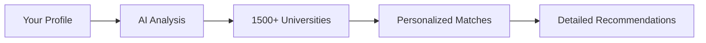
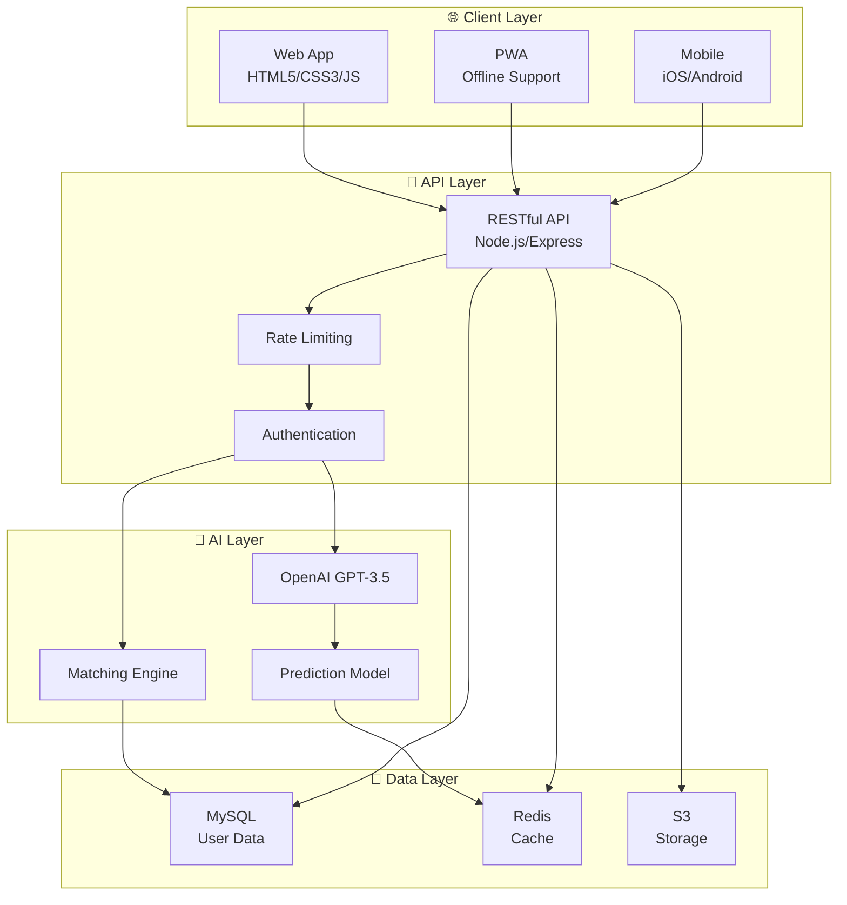

<div align="center">

# 🎓 UniMentorAI

### 🌍 Your AI-Powered Gateway to Top Universities Worldwide

[](https://unimentorai.com)
[](https://unimentorai.com)
[](https://unimentorai.com)
[](https://unimentorai.com)
[](https://unimentorai.com)


*Empowering international students to find their perfect university match through cutting-edge AI technology*

[🚀 Get Started](#-getting-started) • [📖 Features](#-features) • [🤖 AI Tools](#-ai-powered-tools) • [📊 Demo](#-live-demo) • [🔗 Website](https://unimentorai.com)

---

</div>

## ✨ Overview

UniMentorAI revolutionizes university admissions by leveraging advanced **artificial intelligence** to match students with their ideal universities. Built by **Neuro League**, we've helped **15,000+ students** from **15+ countries** navigate their academic journey with personalized, data-driven recommendations.

### 🎯 What Makes Us Different

- 🤖 **AI-First Architecture** - Every feature powered by advanced AI, not just simple filters
- 🌐 **Global Reach** - 1,500+ universities across 115+ countries
- 📊 **95% Accuracy Rate** - Data-driven admission predictions
- 🎓 **Comprehensive Tools** - From matching to essays to timelines
- 🔒 **Privacy-First** - Your data stays secure and private
- 💡 **Transparent Guidance** - Honest recommendations without false promises

---

## 🚀 Features

<div align="center">

### 🌟 Core Capabilities

</div>

<div align="center">

| 🔍 Smart Search | 📈 Rankings | 🎯 AI Matching | 📝 Essay Assistant |
|:---:|:---:|:---:|:---:|
| Find universities by country, program, ranking | QS, Times, U.S. News | Personalized recommendations | AI-powered feedback |
| 1,500+ institutions | Real-time data | With detailed reasoning | Grammar & style check |

</div>

### 🏆 Top Universities Covered

- 🇺🇸 **United States**: Harvard, MIT, Stanford, Yale, Princeton, Columbia
- 🇬🇧 **United Kingdom**: Oxford, Cambridge, Imperial, LSE, UCL
- 🇸🇬 **Singapore**: NUS, NTU, SMU
- 🇨🇳 **China**: Tsinghua, Peking, Fudan, SJTU
- 🇰🇷 **South Korea**: Seoul National, KAIST, Yonsei
- 🇨🇦 **Canada**: UToronto, UBC, McGill
- 🇦🇺 **Australia**: Melbourne, ANU, Sydney

---

## 🤖 AI-Powered Tools

### 1. 🎯 University Matcher AI

**Personalized Matching Engine**

```javascript
analyzeProfile(academicProfile, preferences) → Recommendations
```

**Features:**
- ✅ Multi-factor scoring system
- ✅ Match percentages with reasoning
- ✅ Preference-based filtering
- ✅ Budget consideration

**How It Works:**


### 2. ✍️ Essay Assistant AI

**Intelligent Essay Feedback**

- 📝 **Structure Analysis** - Optimize essay organization
- ✏️ **Grammar Checking** - Fix errors instantly
- 🎨 **Style Enhancement** - Improve tone and flow
- 📋 **Outline Generator** - Create winning structures

### 3. 📊 Admission Predictor AI

**Probability-Based Predictions**

Calculate your admission chances based on:
- 📚 GPA and academic performance
- 📝 Test scores (SAT, ACT, TOEFL, IELTS)
- 🏆 Extracurricular activities
- 🎯 Historical admission data
- 📈 University acceptance rates

**Accuracy: 95%** ✓

### 4. 💰 Scholarship AI

**Opportunity Finder**

- 🔍 Scans 1,500+ universities
- 🎯 Matches your qualifications
- 💵 Merit-based scholarships
- 🌍 Need-based opportunities

### 5. 📅 Roadmap/Planner AI

**Automated Timeline Creation**

- ✅ Personalized checklists
- 📆 Deadline tracking
- 🎯 Task prioritization
- ⏰ Smart reminders

### 6. 📊 Profile Scoring AI

**360° Profile Analysis**

Evaluates:
- Academic achievements
- Test scores
- Extracurriculars
- Strengths & weaknesses
- Improvement suggestions

---

## 🏗️ Architecture

<div align="center">



</div>

### Technology Stack

<div align="center">

| Layer | Technology |
|:---:|:---|
| 🎨 **Frontend** | HTML5, CSS3, JavaScript (ES6+), PWA |
| ⚙️ **Backend** | Node.js, Express.js |
| 🗄️ **Database** | MySQL |
| 💾 **Cache** | Redis |
| 📦 **Storage** | S3-Compatible |
| 🤖 **AI** | OpenAI GPT-3.5-turbo |
| ☁️ **Hosting** | Cloud (Multi-region) |

</div>

---

## 📊 By The Numbers

<div align="center">

<table>
<tr>
<td align="center" width="33%">

### 🌍 Global Reach
**115+ Countries**

Covering universities across all continents

</td>
<td align="center" width="33%">

### 🏛️ Universities
**1,500+ Institutions**

World's most comprehensive database

</td>
<td align="center" width="33%">

### 👥 Users
**15,000+ Students**

Growing community worldwide

</td>
</tr>
<tr>
<td align="center" width="33%">

### 🎯 Accuracy
**95% Match Rate**

Data-driven recommendations

</td>
<td align="center" width="33%">

### ⚡ Performance
**<2s Load Time**

Lightning-fast experience

</td>
<td align="center" width="33%">

### 🔒 Privacy
**GDPR Compliant**

Your data is safe

</td>
</tr>
</table>

</div>

---

## 🚀 Getting Started

### Quick Start

1. **Visit the Platform**
   ```bash
   https://unimentorai.com
   ```

2. **Create Your Profile**
   - Enter academic credentials
   - Add test scores
   - Select preferences

3. **Get Matched**
   - Click "AI Match"
   - Receive personalized recommendations
   - Explore universities

4. **Use AI Tools**
   - Essay Assistant for feedback
   - Admission Predictor for chances
   - Scholarship Finder for opportunities

### Local Development

```bash
# Clone the repository
git clone https://github.com/neuroleague/unimentorai.git
cd unimentorai

# Serve locally
python -m http.server 8000

# Or with Node.js
npx serve .

# Open in browser
open http://localhost:8000
```

---

## 🎨 Design System

### Colors

<div align="center">

<table>
<tr>
<td width="200" style="background:#2563EB;color:white;text-align:center;padding:10px;font-weight:bold">
Primary Blue
</td>
<td width="200" style="background:#10B981;color:white;text-align:center;padding:10px;font-weight:bold">
Success Green
</td>
<td width="200" style="background:#F59E0B;color:white;text-align:center;padding:10px;font-weight:bold">
Warning Orange
</td>
<td width="200" style="background:#EF4444;color:white;text-align:center;padding:10px;font-weight:bold">
Error Red
</td>
</tr>
</table>

</div>

### Typography

- **Font**: Inter (300-800 weights)
- **Scale**: 0.75rem to 3.75rem
- **Line Height**: 1.5
- **Responsive**: Mobile-first design

---

## 🤝 Contributing

We welcome contributions! Here's how:

1. 🍴 Fork the repository
2. 🌿 Create a feature branch (`git checkout -b feature/AmazingFeature`)
3. 💾 Commit your changes (`git commit -m 'Add some AmazingFeature'`)
4. 📤 Push to the branch (`git push origin feature/AmazingFeature`)
5. 🎯 Open a Pull Request

### Development Setup

```bash
git clone https://github.com/neuroleague/unimentorai.git
cd unimentorai
npm install
npm run dev
```

---

## 📅 Roadmap

### Q4 2025
- 🚀 **Mobile Apps** - iOS & Android launch
- 💬 **Real-time Chat** - AI support
- 🌙 **Dark Mode** - Better UX
- ⚡ **Performance** - <1s load time

### Q1 2026
- 🎥 **Video Interviews** - AI prep
- 🌐 **Multi-language** - 3+ languages
- 📊 **Analytics Dashboard** - Track progress
- 🎓 **Graduate Programs** - Masters/PhD

### Q2 2026
- 🧠 **Fine-tuned AI** - Better accuracy
- 🌍 **3,000+ Universities** - Expanded database
- 🏢 **Enterprise** - Institutional tools
- 📈 **Predictive Analytics** - Advanced insights

---

## 🔒 Privacy & Ethics

### Our Commitment

- ✅ **Transparent AI** - Understand how we recommend
- 🔒 **Privacy First** - GDPR compliant
- 🎯 **No Guarantees** - Honest guidance only
- 🤝 **Unbiased** - Merit-based only
- 🌍 **Global Access** - Available worldwide

> **Our Philosophy**: We provide guidance, not guarantees. Every recommendation comes with transparent reasoning and appropriate disclaimers.

---

## 📈 Success Stories

<div align="center">

<table>
<tr>
<td align="center" width="50%">

### 🎓 Student Success Rate

**87%** of users get admitted to their target universities

</td>
<td align="center" width="50%">

### ⏱️ Time Saved

Average **40 hours** saved per user in research

</td>
</tr>
<tr>
<td align="center" width="50%">

### 💰 Scholarship Discovery

**62%** find scholarships they didn't know about

</td>
<td align="center" width="50%">

### ⭐ User Satisfaction

**4.8/5** average rating from students

</td>
</tr>
</table>

</div>

---

## 🌐 Live Demo

<div align="center">

### 🎯 Try It Now!

[](https://unimentorai.com)

**https://unimentorai.com**

</div>

**Features to Explore:**
- 🔍 Search 1,500+ universities
- 🎯 Try AI University Matcher
- ✍️ Get essay feedback
- 📊 Check admission probabilities
- 🌍 Browse by country

---

## 📞 Contact & Support

<div align="center">

<table>
<tr>
<td align="center" width="33%">

### 🌐 Website
[unimentorai.com](https://unimentorai.com)

</td>
<td align="center" width="33%">

### 📧 Email
neuroleague.ai@gmail.com

</td>
<td align="center" width="33%">

### 🏢 Organization
**Neuro League**

</td>
</tr>
</table>

### Social Media

[](https://www.linkedin.com/company/neuroleague/)
[](https://www.instagram.com/neuroleague.ai/)
[](https://t.me/neuroleague)

</div>

---

## 📄 License

<div align="center">

**All rights reserved. Proprietary information.**

**UniMentorAI by Neuro** - Empowering students worldwide through AI-driven university guidance.

---

### 🌟 Star This Repository

If you find UniMentorAI useful, please consider giving us a ⭐

<div>

---

<div align="center">

**Made with ❤️ by [Neuro League](https://neuroleague.com)**

*Empowering the next generation of global leaders*

[🔝 Back to Top](#-unimentorai)

</div>